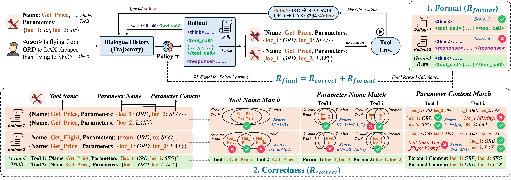

# ToolRL: Reward is All Tool Learning Needs
[**🤗 Model**](https://huggingface.co/) | [**📊 Dataset**](https://github.com/qiancheng0/ToolRL/tree/main/dataset) | [**📖 Paper**](https://arxiv.org/)



ToolRL is the code repository for paper "ToolRL: Reward is All Tool Learning Needs".

Our code is built upon [veRL](https://github.com/volcengine/verl) and [TinyZero](https://github.com/Jiayi-Pan/TinyZero).

## 🔍 Installation
Please install torch, vllm and ray according to your own environment configuration. We provide a configuration example adapted from TinyZero in the following:
```
# install torch
pip install torch==2.4.0 --index-url https://download.pytorch.org/whl/cu121
# install vllm
pip install vllm==0.6.3
pip install ray
```

Please further install the verl in the current project and flash attention.
```
# verl
pip install -e .

# flash attention 2
pip install flash-attn --no-build-isolation
```

## 📊 Dataset
We provide the raw dataset in `./dataset/rlla_4k_raw`, which consists of 2K ToolACE data, 1K Hammer (Masked) data, and 1K xLAM data.

The SFT data includes thought content distilled from Deepseek-R1, whereas the RL data contains only placeholders in the thought field.

For training purposes, the raw data must be further processed. The processed RL training data is available at `./dataset/rlla_4k`.


## 🧪 Training
For GRPO and PPO training, please specify the configuration in `./train_grpo.sh`, including the `BASE_MODEL` and `EXPERIMENT_NAME` variables. The dataset is set by default to `./dataset/rlla_4k`.
```
bash train_grpo.sh  # For GRPO Training
bash train_ppo.sh  # For PPO Training
```

### Reward variants
The training script uses by default the reward function introduced in Section 3.3 (\textit{Reward Design}) of the paper. In the following, we introduce several reward variants that can be activated via environment variables. All reward-specific environment variables are handled in the core reward module located at `./verl/utils/reward\_score/rlla.py`.
```
export WITHLENGTH=1 # Add the settled length reward function (Section 5.1)
export SCHEDULELENGTH=1 # Add the dynamic length reward function (Section 5.1)
export CORRECTMAX1=1 # Change to equal max (Section 5.2)
export MAX1STEP30MAX3=1 # Change to two stage scale (Section 5.2)
export SCHEDULEREWARD=1 # Chenge to smooth dynamic scale (Section 5.2)
export REFINEDREWARD=1 # Change to finegrained reward (Section 5.3)
export INTERMEDIATEREWARD=1 # Change to intermediate reward (Section 5.3)
export COARSEREWARD=1 # Change to coarse reward (Section 5.3)
```

To train the model with a specific reward variant, please enable one of the environment variables described above.


## 🖊️ Citation
```text
@article{qian2025smart,
  title={ToolRL: Reward is All Tool Learning Needs},
  author={Cheng Qian and Emre Can Ackigoz and Qi He and Hongru Wang and Xiusi Chen and Dilek Hakkani-Tür and Gokhan Tur and Heng Ji},
  journal={arXiv preprint arXiv:......},
  year={2025}
}
```